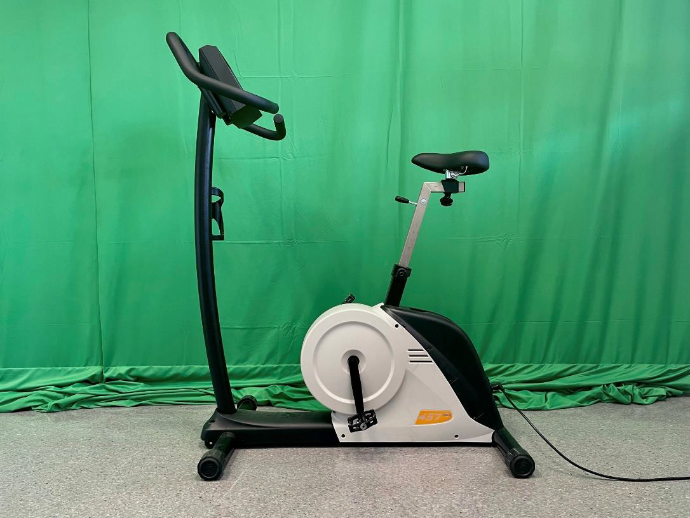

# Leistungsdiagnostik-Tool V0.2

## Anwendungsfall Leistungsdiagnostik

|                                | Erklärung                                                                                                                                                                               | Beispiel                                                                                                                                         |
|--------------------------------|-----------------------------------------------------------------------------------------------------------------------------------------------------------------------------------------|--------------------------------------------------------------------------------------------------------------------------------------------------|
| Name und Identifikationsnummer | *Anwendungsfälle haben einen Namen und werden nach Sachgruppen geordnet durchnummeriert*                                                                                                  | UC 2.01. - Leistungsdiagnostik Stufentest                                                                                                                   |
| Beschreibung                   | *Hier erfolgt eine kurze Beschreibung, was im Anwendungsfall passiert.*                                                                                                                   | Es werden verschiedene Leistungslevel stufenweise mit fester Zeitvorgabe durchlaufen. Einhaltung der Leistung und Vitalparameter wird überwacht. |
| Beteiligte Akteure             | *Akteure sind beteiligte Personen oder Systeme außerhalb des beschriebenen Systems.*                                                                                                      | Diagnostiker:in, Proband:in                                                                                                                      |
| Status                         | *Der Status sagt aus, wie weit die Arbeit an dem Anwendungsfall gediehen ist*                                                                                                             | In Arbeit                                                                                                                                        |
| Verwendete Anwendungsfälle     | *Wenn der Anwendungsfall auf andere Anwendungsfälle zurückgreift, werden diese Fälle hier aufgezählt.*                                                                                    | UC 1.01 (Probandin anlegen), UC 1.02 (Leistungstest anlegen),  UC 1.03 (Alarm bei zu hoher Herzfrequenz),  UC 1.04 (Alarm bei Leistungsabweichung), UC 1.05 (Laktatmessung eingeben)                                                             
| Auslöser                       | *Der fachliche Grund bzw. die Gründe dafür, dass dieser Anwendungsfall ausgeführt wird.*                                                                                                  | Durchführung einer standardisierten Leistungsdiagnose                                                                                           |
| Vorbedingungen                 | *Alle Bedingungen, die erfüllt sein müssen, damit dieser Anwendungsfall ausgeführt werden kann.*                                                                                          | keine                                                                                                                                            |
| Invarianten                    | Alle Bedingungen, die innerhalb und durch den Anwendungsfall nicht verändert werden dürfen, also auch in einem Misserfolgs- oder Fehlerszenario immer noch gewährleistet werden müssen. | Aufzeichnung der bis zum Abbruch erhobenen Daten.                                                                                                |
| Nachbedingung/Ergebnis         | Der Zustand, der nach einem erfolgreichen Durchlauf des Anwendungsfalls erwartet wird.                                                                                                  | Ergometer wird in Ruhemodus versetzt (UC 2.01)                                                                                                   |
| Standardablauf                 | Hier wird das typische Szenario dargestellt, das leicht zu verstehen oder der am häufigsten vorkommende Fall ist.                                                                       | Alle Leistungsstufen werden nacheinander durchlaufen. Überprüfung, ob Leistungswerte eingehalten. Daten werden gespeichert.                     |
| Alternative Ablaufschritte     | Dies sind Szenarien, die sich außerhalb des Standardablaufs auch bei der (versuchten) Zielerreichung des Anwendungsfalls ereignen können.                                               | Widerstandswerte werden verletzt. Neustart und Abbruch werden angeboten.                                                                         |
| Hinweise                       | Kurze Erklärungen zum besseren Verständnis, Hinweise zu Nebeneffekten, Mengengerüsten soweit erforderlich und alles andere, das nicht weiter oben dargestellt werden kann.              | keine                                                                                                                                            |
| Änderungsgeschichte            | Versionierung, Name des Autors, Datum                                                                                                                                                   | 0.2; 7.02.2024.; Julian Huber                                                                                                                  |

